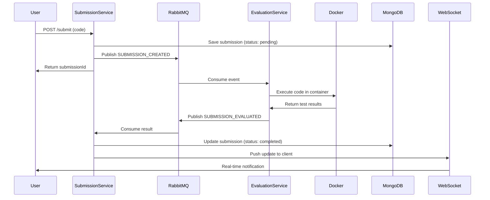

<div align="center">

# 🚀 CodeXFlow

### *Distributed Online Judge Backend System*

[](https://www.typescriptlang.org/)
[](https://nodejs.org/)
[](https://www.docker.com/)
[](https://www.rabbitmq.com/)
[](https://www.mongodb.com/)
[](https://developer.mozilla.org/en-US/docs/Web/API/WebSocket)

**A scalable, event-driven backend system for an online coding judge platform** 🎯

[Features](#-features) • [Architecture](#-architecture) • [Quick Start](#-quick-start) • [Documentation](#-documentation) • [Contributing](#-contributing)

---

</div>

## 📖 Table of Contents

- [About](#-about-the-project)
- [Features](#-features)
- [Architecture](#-architecture)
- [Tech Stack](#-tech-stack)
- [Services](#-services)
- [Getting Started](#-getting-started)
- [API Documentation](#-api-documentation)
- [WebSocket Guide](#-websocket-real-time-updates)
- [Project Structure](#-project-structure)
- [Roadmap](#-roadmap)
- [Contributing](#-contributing)
- [Author](#-author)
- [License](#-license)

---

## 🎯 About The Project

CodeXFlow is a **production-ready distributed system** that powers online coding judge platforms like LeetCode and Codeforces. Built with modern microservices architecture, it handles code submissions asynchronously, evaluates them in isolated Docker containers, and delivers real-time status updates to clients via WebSockets.

### 💡 What Makes CodeXFlow Special?

- **🔥 Event-Driven Architecture** - Loose coupling between services for maximum scalability
- **⚡ Real-Time Updates** - WebSocket-powered instant feedback to users
- **🐳 Secure Execution** - Isolated Docker containers prevent malicious code execution
- **📊 Persistent Storage** - MongoDB as the single source of truth
- **🔄 Async Processing** - RabbitMQ-powered message queuing for high throughput
- **🧩 Microservices** - Service-oriented design for independent scaling

---

## ✨ Features

<details open>
<summary><b>Core Features</b></summary>

- 📨 **Asynchronous Code Evaluation** - Non-blocking submission handling using RabbitMQ
- 🐳 **Containerized Execution** - Secure, isolated code execution in Docker
- 📊 **Submission Tracking** - Complete submission lifecycle management
- ⚡ **Real-Time Notifications** - WebSocket-based live updates
- 🔄 **Event-Driven Communication** - Decoupled services with message queues
- 🧱 **Microservices Architecture** - Independently deployable services
- 🛡️ **Safe Code Execution** - Sandboxed environment with resource limits

</details>

<details>
<summary><b>Technical Highlights</b></summary>

- ✅ TypeScript for type safety
- ✅ RESTful API design
- ✅ Message-driven architecture
- ✅ Container orchestration ready
- ✅ Horizontal scaling capable
- ✅ Backend-only MVP (no frontend dependency)

</details>

---

## 🏗️ Architecture

### High-Level System Design

```
┌─────────────────────────────────────────────────────────────────┐
│                           CLIENT                                │
└────────────────────────────┬────────────────────────────────────┘
                             │
                             │ HTTP POST /submit
                             ↓
┌─────────────────────────────────────────────────────────────────┐
│                    SUBMISSION SERVICE                           │
│  ┌──────────────┐  ┌──────────────┐  ┌────────────────────┐   │
│  │   REST API   │  │   MongoDB    │  │  WebSocket Server  │   │
│  └──────────────┘  └──────────────┘  └────────────────────┘   │
└──────────────┬──────────────────────────────────────┬───────────┘
               │                                      │
               │ Publish Event                        │ Real-time
               │ SUBMISSION_CREATED                   │ Updates
               ↓                                      ↓
┌─────────────────────────────┐              ┌──────────────┐
│       RABBITMQ QUEUE        │              │   CLIENT     │
└──────────────┬──────────────┘              └──────────────┘
               │
               │ Consume Event
               ↓
┌─────────────────────────────────────────────────────────────────┐
│                    EVALUATION SERVICE                           │
│  ┌──────────────┐  ┌──────────────┐  ┌────────────────────┐   │
│  │  Job Worker  │  │   Dockerode  │  │   Test Executor    │   │
│  └──────────────┘  └──────────────┘  └────────────────────┘   │
└──────────────┬──────────────────────────────────────────────────┘
               │
               │ Execute in Docker Container
               │
               ↓
┌─────────────────────────────┐
│      DOCKER RUNTIME         │
│   ┌─────────────────────┐   │
│   │   User Code         │   │
│   │   + Test Cases      │   │
│   └─────────────────────┘   │
└──────────────┬──────────────┘
               │
               │ Publish Result
               │ SUBMISSION_EVALUATED
               ↓
       Back to Submission Service
```

### Event Flow (Submission Lifecycle)



---

## 🛠️ Tech Stack

<table>
<tr>
<td align="center" width="25%">

<br><b>TypeScript</b>
<br><sub>Type-safe code</sub>
</td>
<td align="center" width="25%">

<br><b>Node.js</b>
<br><sub>Runtime environment</sub>
</td>
<td align="center" width="25%">

<br><b>Express</b>
<br><sub>API framework</sub>
</td>
<td align="center" width="25%">

<br><b>Docker</b>
<br><sub>Containerization</sub>
</td>
</tr>
<tr>
<td align="center" width="25%">

<br><b>MongoDB</b>
<br><sub>Database</sub>
</td>
<td align="center" width="25%">

<br><b>RabbitMQ</b>
<br><sub>Message broker</sub>
</td>
<td align="center" width="25%">

<br><b>WebSocket</b>
<br><sub>Real-time updates</sub>
</td>
<td align="center" width="25%">

<br><b>Git</b>
<br><sub>Version control</sub>
</td>
</tr>
</table>

### Technology Breakdown

| Layer | Technology | Purpose |
|-------|-----------|---------|
| **Backend Runtime** | Node.js + TypeScript | Type-safe, scalable runtime |
| **API Framework** | Express | RESTful API endpoints |
| **Messaging** | RabbitMQ | Event-driven communication |
| **Database** | MongoDB | Persistent storage |
| **Execution** | Docker + Dockerode | Isolated code execution |
| **Real-time** | WebSockets (ws) | Live updates to clients |
| **Architecture** | Microservices | Independent, scalable services |

---

## 🧩 Services

### 1️⃣ Submission Service

**Role:** User-facing service for submission management

<details>
<summary><b>Responsibilities</b></summary>

- ✅ Accept code submissions via REST API
- ✅ Persist submission metadata to MongoDB
- ✅ Publish evaluation jobs to RabbitMQ
- ✅ Consume evaluation results from queue
- ✅ Push real-time updates via WebSockets
- ✅ Serve submission status queries

</details>

**Tech Stack:** Node.js • TypeScript • Express • MongoDB • RabbitMQ • WebSockets

**Key Endpoints:**
```
POST   /api/submit          - Submit code for evaluation
GET    /api/submission/:id  - Get submission details
WS     /ws?submissionId=x   - WebSocket connection
```

---

### 2️⃣ Evaluation Service

**Role:** Background worker for code execution

<details>
<summary><b>Responsibilities</b></summary>

- ✅ Consume evaluation jobs from RabbitMQ
- ✅ Execute user code inside Docker containers
- ✅ Run test cases safely with resource limits
- ✅ Capture stdout/stderr and execution results
- ✅ Emit evaluation results back to Submission Service

</details>

**Tech Stack:** Node.js • TypeScript • Docker • Dockerode • RabbitMQ

**Execution Flow:**
```
1. Pull job from queue
2. Fetch problem test cases
3. Spin up Docker container
4. Execute code with test inputs
5. Capture results and cleanup
6. Publish results to queue
```

---

### 3️⃣ Problem Service

**Role:** Read-only service for problem metadata

<details>
<summary><b>Responsibilities</b></summary>

- ✅ Manage problem definitions
- ✅ Expose test cases to Evaluation Service
- ✅ Provide problem difficulty and tags
- ✅ Support problem search and filtering

</details>

**Tech Stack:** Node.js • TypeScript • REST APIs

---

## 🚀 Getting Started

### Prerequisites

Before you begin, ensure you have the following installed:

- **Node.js** (v18 or higher) - [Download](https://nodejs.org/)
- **Docker** - [Download](https://www.docker.com/get-started)
- **RabbitMQ** - [Installation Guide](https://www.rabbitmq.com/download.html)
- **MongoDB** - [Installation Guide](https://www.mongodb.com/docs/manual/installation/)

### Installation

<details open>
<summary><b>Step-by-Step Setup</b></summary>

#### 1. Clone the Repository

```bash
git clone https://github.com/chitwang12/CodeXFloww.git
cd CodeXFloww
```

#### 2. Install Dependencies

```bash
# Install for all services
npm install

# Or install individually
cd SubmissionService && npm install
cd EvaluationService && npm install
cd ProblemService && npm install
```

#### 3. Environment Setup

Create `.env` files in each service directory:

**SubmissionService/.env**
```env
PORT=3002
MONGODB_URI=mongodb://localhost:27017/codexflow
RABBITMQ_URL=amqp://localhost:5672
WS_PORT=3003
```

**EvaluationService/.env**
```env
RABBITMQ_URL=amqp://localhost:5672
DOCKER_SOCKET=/var/run/docker.sock
```

#### 4. Start Services

**Option A: Manual Start**
```bash
# Terminal 1 - Submission Service
cd SubmissionService
npm run dev

# Terminal 2 - Evaluation Service
cd EvaluationService
npm run dev

# Terminal 3 - Problem Service
cd ProblemService
npm run dev
```

**Option B: Docker Compose (if available)**
```bash
docker-compose up -d
```

#### 5. Verify Installation

```bash
# Check Submission Service
curl http://localhost:3002/health

# Check RabbitMQ
curl http://localhost:15672

# Check MongoDB
mongo --eval "db.stats()"
```

</details>

---

## 📡 API Documentation

### REST Endpoints

<details>
<summary><b>Submission Service APIs</b></summary>

#### Submit Code

```http
POST /api/submit
Content-Type: application/json

{
  "problemId": "two-sum",
  "language": "javascript",
  "code": "function twoSum(nums, target) { ... }"
}
```

**Response:**
```json
{
  "submissionId": "69791bdd60ae0abd875723c3",
  "status": "pending",
  "message": "Submission received"
}
```

#### Get Submission Status

```http
GET /api/submission/:submissionId
```

**Response:**
```json
{
  "submissionId": "69791bdd60ae0abd875723c3",
  "problemId": "two-sum",
  "status": "completed",
  "result": "passed",
  "testCasesPassed": 15,
  "totalTestCases": 15,
  "executionTime": "45ms"
}
```

</details>

---

## ⚡ WebSocket Real-Time Updates

### Connection

```javascript
const ws = new WebSocket('ws://localhost:3003/ws?submissionId=YOUR_SUBMISSION_ID');

ws.onopen = () => {
  console.log('Connected to submission updates');
};

ws.onmessage = (event) => {
  const data = JSON.parse(event.data);
  console.log('Submission Update:', data);
  // { submissionId, status, result, testCasesPassed, ... }
};

ws.onerror = (error) => {
  console.error('WebSocket error:', error);
};

ws.onclose = () => {
  console.log('WebSocket connection closed');
};
```

### Testing Without Frontend

<details>
<summary><b>Using wscat (CLI tool)</b></summary>

```bash
# Install wscat
npm install -g wscat

# Connect to WebSocket
wscat -c "ws://localhost:3003/ws?submissionId=YOUR_SUBMISSION_ID"

# You'll receive real-time updates
```

</details>

<details>
<summary><b>Using Node.js Script</b></summary>

```bash
# Run the included test script
npx ts-node scripts/ws-test.ts
```

</details>

### WebSocket Message Format

```json
{
  "submissionId": "69791bdd60ae0abd875723c3",
  "status": "running",
  "currentTestCase": 5,
  "totalTestCases": 15,
  "result": null
}
```

**Status Values:**
- `pending` - Waiting in queue
- `running` - Currently executing
- `completed` - Evaluation finished
- `failed` - Execution error

---

## 📂 Project Structure

```
CodeXFloww/
│
├── SubmissionService/
│   ├── src/
│   │   ├── app.ts                 # Express app setup
│   │   ├── server.ts              # Server entry point
│   │   ├── controllers/
│   │   │   └── submissionController.ts
│   │   ├── models/
│   │   │   └── Submission.ts      # MongoDB schema
│   │   ├── messaging/
│   │   │   ├── publisher.ts       # RabbitMQ producer
│   │   │   └── consumer.ts        # RabbitMQ consumer
│   │   └── webSockets/
│   │       └── wsHandler.ts       # WebSocket logic
│   ├── package.json
│   └── tsconfig.json
│
├── EvaluationService/
│   ├── src/
│   │   ├── index.ts               # Service entry point
│   │   ├── messaging/
│   │   │   ├── consumer.ts        # Job consumer
│   │   │   └── publisher.ts       # Result publisher
│   │   ├── executor/
│   │   │   └── codeExecutor.ts    # Docker execution logic
│   │   └── docker/
│   │       └── containerManager.ts
│   ├── package.json
│   └── tsconfig.json
│
├── ProblemService/
│   ├── src/
│   │   ├── app.ts
│   │   ├── controllers/
│   │   │   └── problemController.ts
│   │   ├── models/
│   │   │   └── Problem.ts
│   │   └── routes/
│   │       └── problemRoutes.ts
│   ├── package.json
│   └── tsconfig.json
│
├── scripts/
│   └── ws-test.ts                 # WebSocket test utility
│
├── docker-compose.yml             # Multi-container setup
├── README.md
└── LICENSE
```

---

## 🗺️ Roadmap

### ✅ MVP (Current)

- [x] Basic submission flow
- [x] Docker-based execution
- [x] RabbitMQ integration
- [x] WebSocket notifications
- [x] MongoDB persistence

### 🚧 In Progress

- [ ] JWT authentication for WebSockets
- [ ] Live test case progress updates
- [ ] Multiple language support (Python, Java, C++)
- [ ] Resource limit enforcement (CPU/Memory)

### 🔮 Future Enhancements

- [ ] 🔐 **Authentication & Authorization** - User login and session management
- [ ] 📈 **Leaderboard System** - Global and problem-specific rankings
- [ ] 🔄 **Redis Pub/Sub** - Horizontal scaling for WebSockets
- [ ] 🌐 **Frontend UI** - React-based user interface
- [ ] 📊 **Analytics Dashboard** - System metrics and insights
- [ ] 🧪 **Advanced Sandboxing** - Enhanced security with seccomp
- [ ] 🚀 **Kubernetes Deployment** - Container orchestration
- [ ] 📝 **Code Plagiarism Detection** - Similarity analysis
- [ ] 💬 **Discussion Forum** - Community features
- [ ] 🏆 **Contests & Challenges** - Time-bound competitions

---

## 🚧 Current Limitations

> **Note:** This is an MVP (Minimum Viable Product) with intentional scope limitations

| Limitation | Reason | Future Plan |
|------------|--------|-------------|
| No frontend UI | Backend-focused MVP | React frontend planned |
| No authentication | Simplified for demo | JWT + OAuth integration |
| No rate limiting | MVP scope | Redis-based rate limiter |
| Single WebSocket instance | Simple implementation | Redis Pub/Sub for scaling |
| Limited languages | Core functionality focus | Multi-language support |
| No resource limits | Basic Docker execution | Cgroups + resource quotas |

---

## 🎯 Why This Project?

CodeXFlow was built to:

- 🧠 **Understand distributed systems** - Real-world microservices architecture
- 🔄 **Learn event-driven design** - Message queues and async processing
- 🐳 **Explore containerization** - Docker-based code execution
- ⚡ **Master WebSockets** - Real-time communication patterns
- 🏗️ **Simulate production systems** - Like LeetCode/Codeforces internals

### Learning Outcomes

✅ Event-driven architecture patterns  
✅ Microservices communication  
✅ Docker API integration  
✅ Message queue design (RabbitMQ)  
✅ WebSocket implementation  
✅ NoSQL database modeling  
✅ TypeScript best practices  

---

## 🤝 Contributing

Contributions are what make the open-source community amazing! Any contributions you make are **greatly appreciated**.

<details>
<summary><b>How to Contribute</b></summary>

1. **Fork the Project**
   ```bash
   git clone https://github.com/YOUR_USERNAME/CodeXFloww.git
   ```

2. **Create your Feature Branch**
   ```bash
   git checkout -b feature/AmazingFeature
   ```

3. **Commit your Changes**
   ```bash
   git commit -m 'Add some AmazingFeature'
   ```

4. **Push to the Branch**
   ```bash
   git push origin feature/AmazingFeature
   ```

5. **Open a Pull Request**

</details>

### 💡 Contribution Ideas

- Add support for new programming languages
- Implement resource limit enforcement
- Create a frontend interface
- Add comprehensive test coverage
- Improve error handling
- Write documentation
- Fix bugs

---

## 👨‍💻 Author

<div align="center">

### **Chitwan Gandhi**

Backend Engineer | Distributed Systems Enthusiast

[](https://github.com/chitwang12)
[](https://www.linkedin.com/in/chitwang12/)
[](mailto:chitwangandhi@gmail.com)

*"Building scalable systems, one microservice at a time"*

</div>

---

## 📄 License

Distributed under the MIT License. See `LICENSE` for more information.

---

## 🙏 Acknowledgments

- Inspired by [LeetCode](https://leetcode.com/) and [Codeforces](https://codeforces.com/)
- Built with amazing open-source tools
- Thanks to the developer community for continuous learning

---

<div align="center">

### ⭐ Star this repo if you find it helpful!

**Made with ❤️ by Chitwan Gandhi**

[⬆ Back to Top](#-codexflow)

</div>
